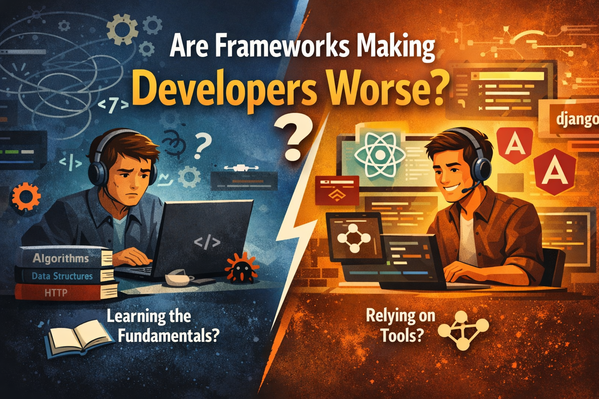
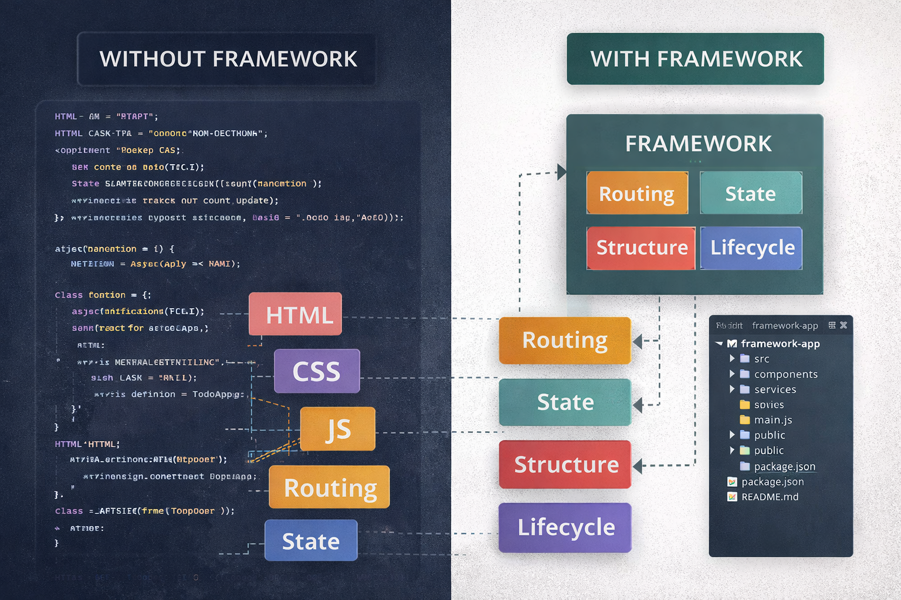
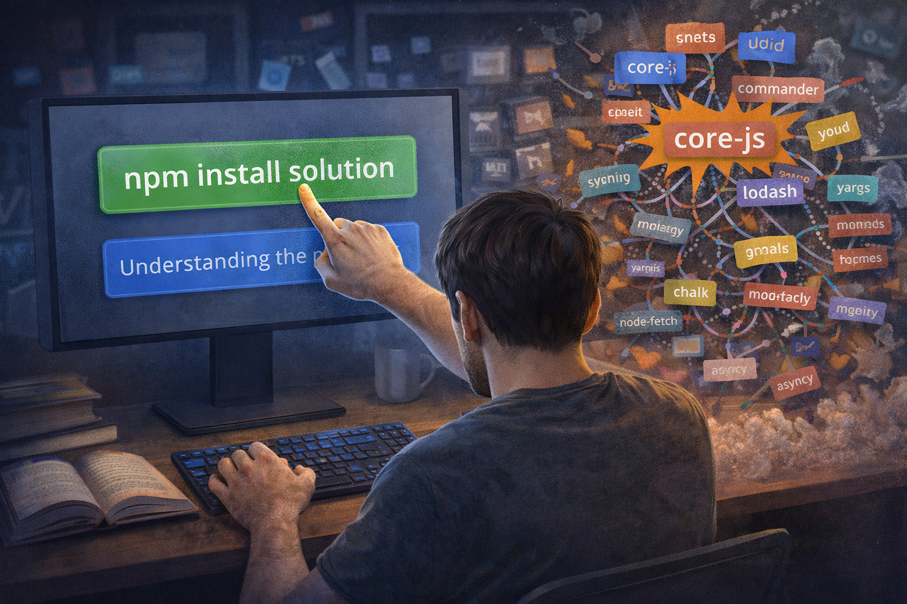
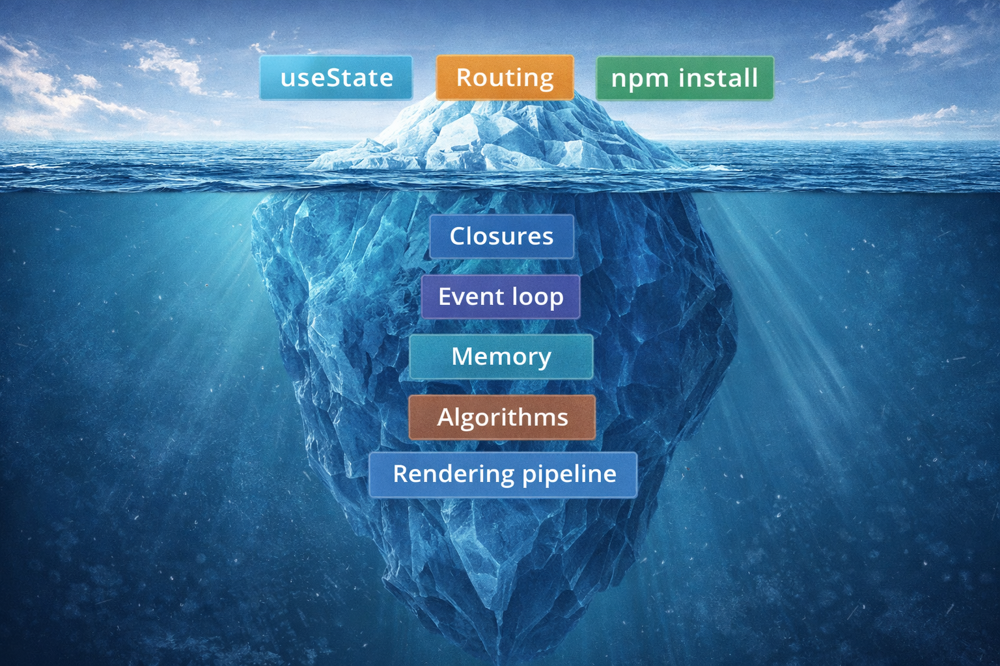
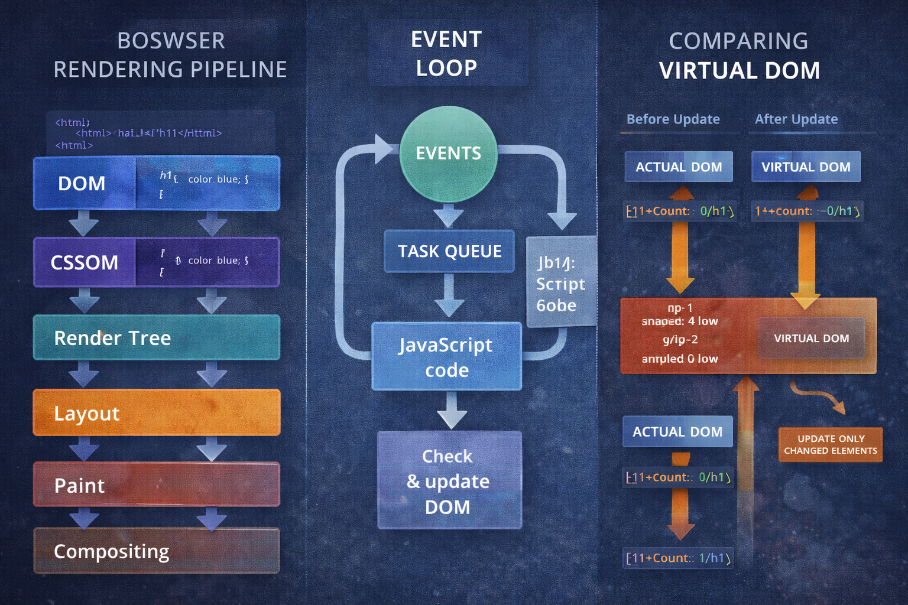
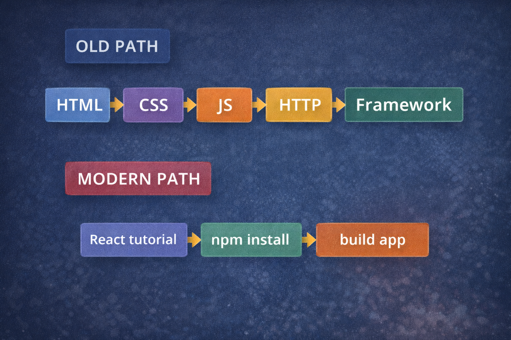
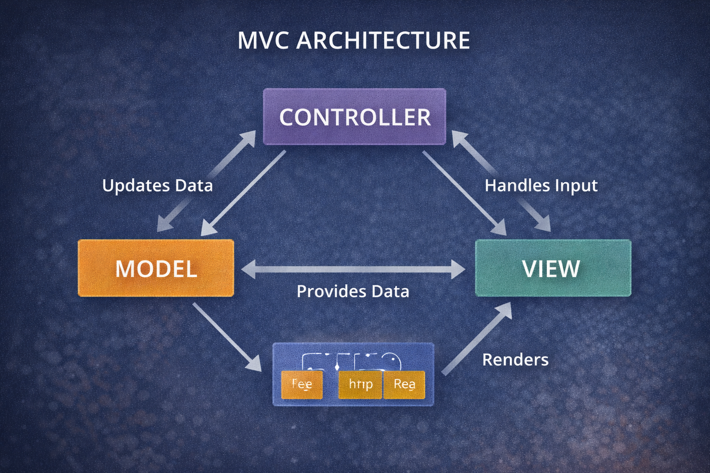

# Are Frameworks Making Developers Worse?

> 📖 Originally published on Medium  
> https://medium.com/@kavindup52/are-frameworks-making-developers-worse-6fb468ca164bh

In today's world of building software, frameworks are everywhere. Tools like Angular, React, and Vue.js for the front part of apps, and Spring Boot and Django for the back part, help create most apps we use. They make things easier and faster. But here's a big question: Do these tools make developers less good at their job? This idea makes us think hard about how tech is changing. Let's look at both sides with easy examples and fair views to help you decide.

---

## 📈 How Frameworks Became So Popular

Frameworks were made to solve real problems in coding:

- They cut out boring, repeated code.  
- They give a clear way to organize your work and follow good rules.  
- They speed up building things.  
- They have help from many people and extra tools.  

For example, React lets you change the screen without touching the real web page parts by hand. Angular gives ready tools for sharing data, moving between pages, web requests, and setting up projects.

This helps get work done quicker. But being fast doesn't always mean being deeply skilled.

---

## ⚠️ The Problem of Depending Too Much on Frameworks

Some developers are starting to show a pattern:

- They can make a basic app in React that adds, shows, changes, or deletes info.  
- But they can't explain how a web browser draws the page.  

- They can use Angular's helper parts.  
- But they don't know how web messages (HTTP) really work.  

- They can add ready-made code packs with npm.  
- But they can't write the main logic without help from others.  

When people only use these high-level tools, they might:

- Have trouble working without their favorite framework.  
- Be scared to try new tools.  
- Forget basic coding rules.  
- Fix bugs by guessing, not knowing the real reason.  

Knowing a framework isn't the same as being a true engineer.

---

## 🧠 The Fake Feeling of Being Good

Frameworks can make you think you're an expert when you're not.

Someone who knows how to:

- Use `useState` in React.  
- Set up page paths.  
- Add code packs.  

Might seem skilled. But that doesn't mean they get:

- How functions remember things (closures).  
- How tasks wait in line (event loop).  
- How memory is used.  
- Making code run fast (algorithms).  
- Planning big systems.  

Frameworks hide hard stuff. That's what they're for. But the hard stuff is still there you just can't see it.

---

## ⚖️ But Frameworks Aren't Bad

It's not fair to blame frameworks alone. They are just tools. The real issue is how people learn to use them.

A hammer doesn't make a builder bad. But if you only use an electric nail tool, you might struggle without it.

In the same way:

- Good developers learn the basics first.  
- Weak ones just copy patterns without knowing why.  

The trouble isn't with React or Angular. It's skipping the basic lessons.

---

## 🔍 Why Basic Skills Are More Important Now

Think about this: When React updates the screen, it compares changes in a fake web page (virtual DOM).

If you don't know:

- How the real web page works.  
- What slows down drawing.  
- How JavaScript runs code.  

You can't make it faster.

When Angular checks for changes, do you understand:

- The tool called Zone.js.  
- How it looks for updates.  
- The steps in a part's life?  

Frameworks let you do easy stuff. But to be great, you need to know more.

---

## 👶 Do New Developers Suffer More?

Yes, especially those just starting who jump right into frameworks.

Many beginners:

- Learn React before plain JavaScript.  
- Use Express for web servers before raw web basics.  
- Use tools that hide database commands without learning them.  

This makes developers who can put apps together but can't plan big projects.

---

## 🌟 How Frameworks Can Make Developers Better

On the other hand, frameworks have big upsides:

- They teach ways to organize code (like separating data, view, and control).  
- They make you think in small, reusable parts.  
- They help reuse code.  
- They keep things the same.  
- They make teams work together better.  

Big apps today need frameworks. No big company builds everything from nothing in plain code.

Frameworks let coders focus on real problems, not basic setup. So, they make the whole field better and more productive.

---

## ❓ The True Question

It's not just: **"Do frameworks make developers worse?"**

It's better to ask:

**"Are developers using frameworks to skip learning instead of to help learning?"**

Frameworks speed things up. They shouldn't replace knowing the basics.

---

## 🛠️ How to Not Become a Framework-Only Developer

If you're coding, especially as a learner, here's how to stay strong:

### 1. Build Without Frameworks Sometimes 🏗️

- Make a small app with just HTML, CSS, and plain JS.  
- Create your own way to switch pages.  
- Build a simple system to handle data changes.  

---

### 2. Learn What's Inside 🔬

- See how React matches up parts.  
- Understand Angular's data sharing.  
- Look at the steps behind the scenes.  

---

### 3. Get Good at Core Ideas 📚

- Ways to store data.  
- Steps to solve problems fast.  
- Basic web connections.  
- How memory works.  
- Doing things at the same time.  
- Working with data stores.  

---

### 4. Fix Problems the Tough Way 🐞

Don't grab a ready tool right away:

- Try to fix it yourself first.  
- Learn why the easy tool was made.  

---

## 💭 My Real Opinion

Frameworks don't make developers bad. Lazy learning does.

They can:

- Help okay developers get work done.  
- Make top developers super strong.  
- Trap weak ones in needing help.  

The tool itself is fine. It's your way of thinking that matters.

---

## 🔚 Last Thoughts

Frameworks are here forever. The field grows by hiding hard parts.

But the best coders:

- Know what's under the hood.  
- Can change tools easily.  
- Can start from nothing if needed.  
- Use frameworks on purpose, not without thinking.  

Instead of wondering if frameworks hurt…

Ask:

**If my framework went away tomorrow, could I still make software?**

That's the key test.
