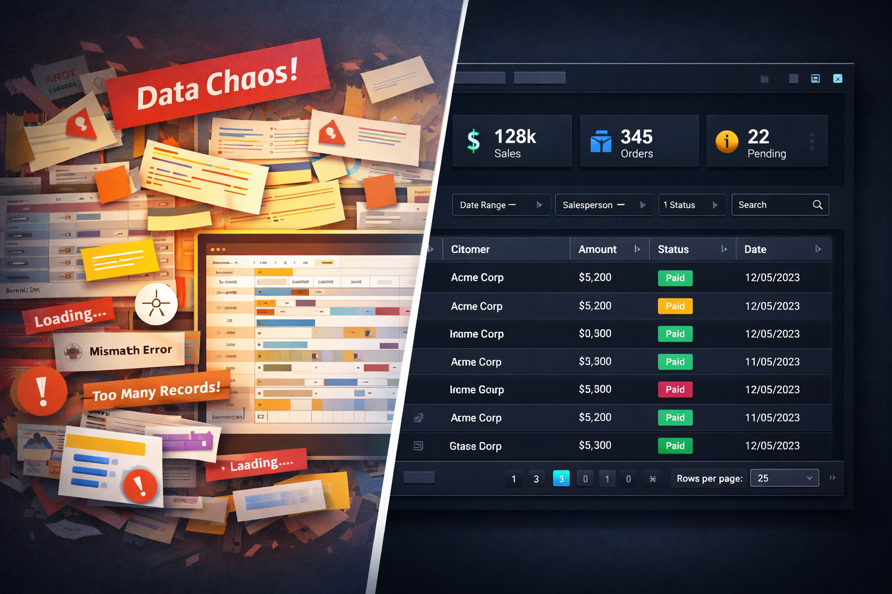
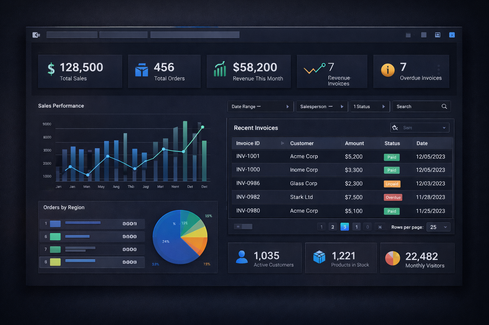
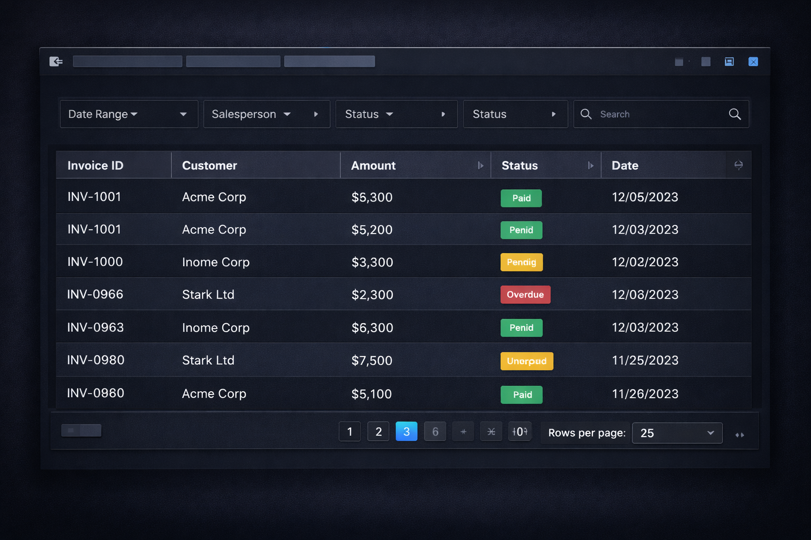
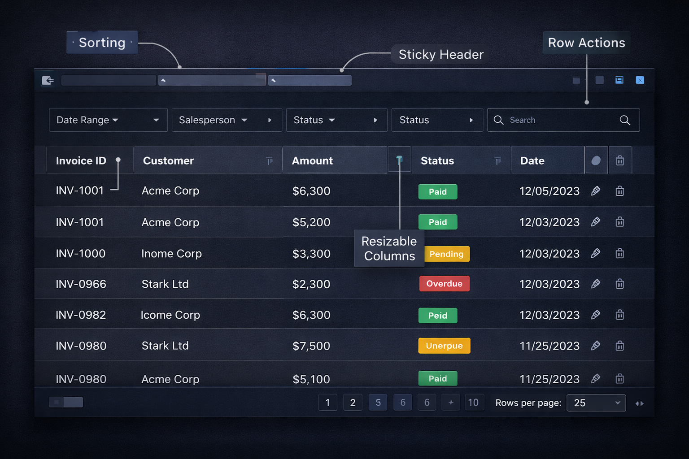
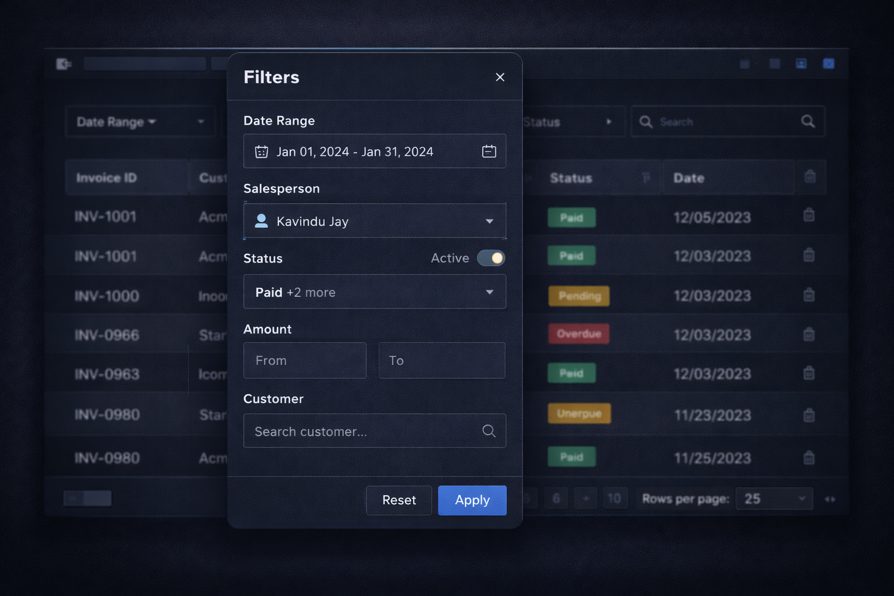
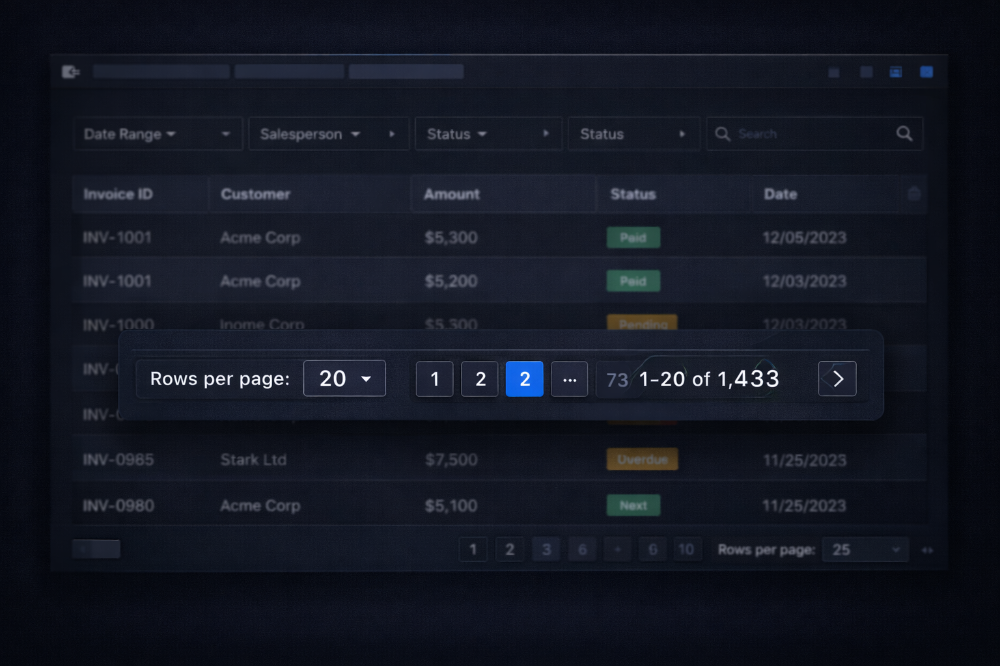
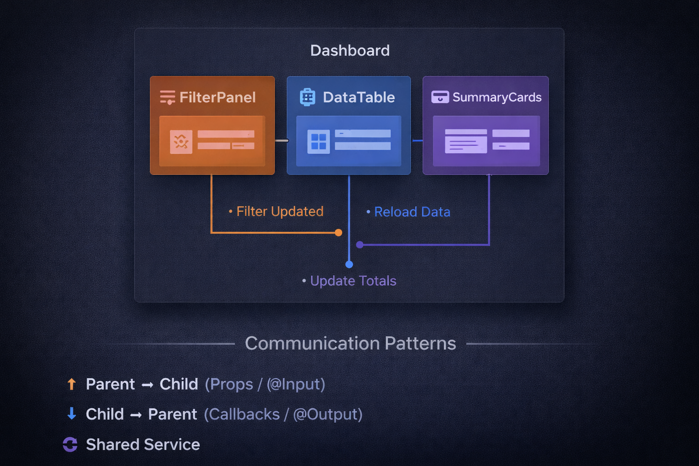
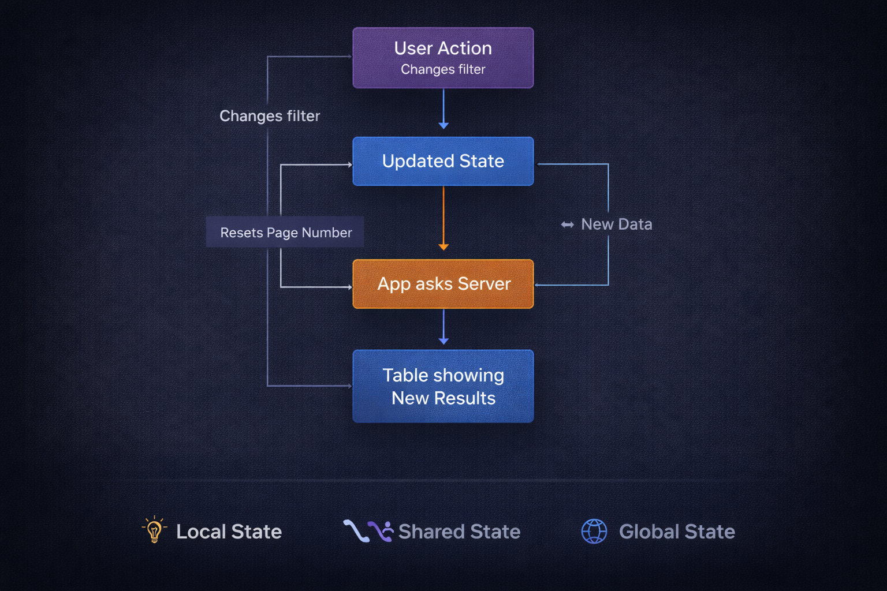
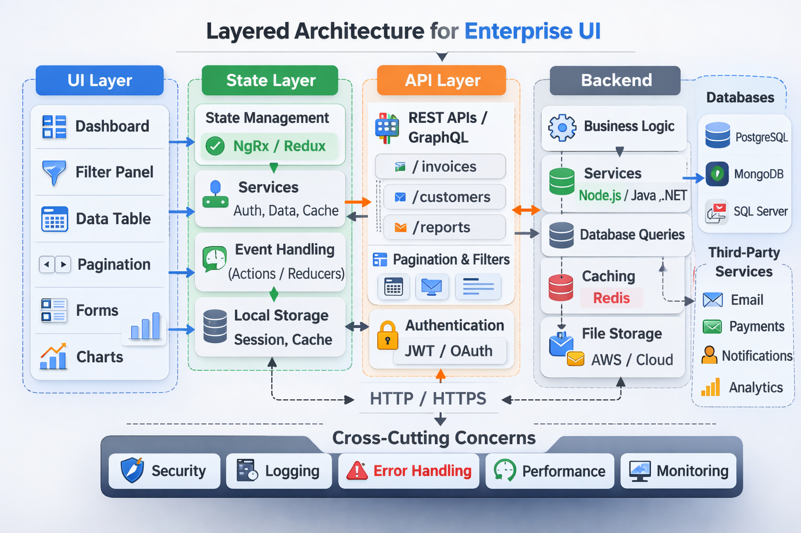

# Building Enterprise UI Components That Scale
## A practical guide using real enterprise scenarios



> 📖 Originally published on Medium  
> https://medium.com/@kavindup52/building-enterprise-ui-components-that-scale-4965460b82a6

Enterprise apps are not simple home pages. They help finance teams, warehouse workers, HR people, and operations staff who use data every single day. When you make UI components for these big systems, you are making useful tools not just pretty decorations.

In this article, we explain how to create UI components that can grow big, using:

- Real examples from business apps  
- Tables, filters, and page splitting  
- How components share information  
- Basic ways to handle state (data memory)  

---

## 🏢 What "Enterprise Scale" Really Means


In real company software, the interface needs to deal with:

- Thousands or even millions of records  
- Different views for different user roles  
- Complicated step-by-step processes  
- Sessions that stay open for many hours  
- Very high need for no crashes or errors  

Examples:

- A sales system that shows more than 50,000 transactions  
- An inventory app that tracks stock in many warehouses  
- An HR system that handles employees from different teams  
- A bank dashboard that lists daily money movements  

Enterprise scale means the app stays fast, easy to update, and very clear to use.

---

## 📊 Real Scenario: Sales Management Dashboard


Picture this: you are making a dashboard for a medium-sized company that sells and delivers goods.

Users want to:

- See all invoices  
- Filter by a date period  
- Filter by which salesperson  
- Search by customer name  
- Sort by total amount  
- Move between pages of results  
- Download the data  

The table is the main and most important part of the whole system.

---

## 🧾 Designing Tables That Scale


Tables in big company systems need to have these features:

### ✅ Sorting

Let users sort by:

- Date  
- Amount of money  
- Status (like paid or pending)  
- Customer name  

---

### ✅ Column Management

Users can:

- Change width of columns (resize)  
- Show or hide columns  
- Keep headers fixed at the top  
- Keep action buttons stuck on the side  

---

### ✅ Row Actions

Each row can have buttons like:

- Edit  
- Delete  
- View more details  
- Approve or Reject  

---

### 🔥 Performance Rule

**Never try to load 10,000 rows all at once in the browser.**

Always use **server-side pagination** (get small chunks of data from the server page by page).

---

## 🔍 Filters: Making Data Easy to Use



Company users do not want to scroll forever they want to filter quickly to find what they need.

Common types of filters in enterprise apps:

- Date range picker (choose start and end date)  
- Dropdown where you can pick many options  
- Toggle for status (like on/off for active/inactive)  
- Simple search box  
- Range for numbers (like amount from X to Y)  

Example in real use:


Date: 01 Jan – 31 Jan
Salesperson: Kavindu
Status: Paid
Amount > 50,000


Good filters should:

- Be easy to control  
- Update the table right away or when user clicks "Apply"  
- Remember the choices even if user goes to another page (very important!)  

---

## 📄 Pagination: Keeping the Interface Fast



Common ways to split pages:

- Server-side pagination (best choice for big enterprise apps)  
- Infinite scrolling (load more as you scroll down)  
- "Load more" button  

### Why choose server-side?

Because big systems often have:

- Over 100,000 rows  
- Complex data connections  
- Calculations added together  

Your API should allow requests like:


GET /invoices?page=1&limit=20&status=paid&salesperson=3

"

This keeps:

- Low memory use in browser  
- Small data sent over network  
- Stable and fast performance  

---

## 🔄 Component Communication (How Components Talk to Each Other)


In big apps, components almost never work alone.

Example layout:

```
Dashboard
├── FilterPanel
├── DataTable
└── SummaryCards
```


When user changes a filter:

- FilterPanel sends the change  
- DataTable gets new data  
- SummaryCards update the totals  

### Ways components talk:

#### 1️⃣ Parent → Child

Using props or `@Input`

#### 2️⃣ Child → Parent

Using callbacks, events, or `@Output`

#### 3️⃣ Shared Service

Good for components that are not directly connected  

In very large apps, avoid passing props through many levels (**prop drilling**) it gets messy.

---

## 🧠 State Management Basics



When apps get bigger, keeping data only inside one component is not enough.

State (remembered data) includes things like:

- Current page number  
- Active filters  
- Which column is sorted  
- Which rows are selected  
- Info about the logged-in user  
- Saved results from API calls  

### Levels of state:

#### 🟢 Local State

Good for small things like:

- Is modal open or closed?  
- Value in an input box  
- On/off toggle  

---

#### 🟡 Shared State

Good for things used in a few parts like:

- Filter settings  
- Table page and sort  
- User choices saved  

---

#### 🔴 Global State

Good for app-wide things like:

- Login status  
- User permissions  
- Color theme  
- Notifications everywhere  

---

### Example simple flow:


```
User changes filter →
State gets updated →
App asks server for new data →
Table shows new results →
Page number resets if needed →
Summary numbers update
```


Everything happens in a clear order. No surprise changes or bugs.

---

## 🏗 Real Enterprise Architecture Pattern



A clean and growable setup usually has:

- UI Layer (the visual components)  
- State Layer (store or services that hold data)  
- API Layer (code that talks to server)  
- Backend (server that supports pagination + filtering)  

Keep each part separate this makes everything easier to fix and grow.

---

## ⚡ Common Enterprise UI Mistakes

- ❌ Loading all data at once into the browser  
- ❌ Putting business rules inside visual components  
- ❌ No clear plan for pagination  
- ❌ Filters forget settings when you move pages  
- ❌ No single place for important state  
- ❌ Components too tightly connected (hard to change one without breaking others)  

---

## 🚀 Final Thoughts

Enterprise UI components should be:

- Fast and performant  
- Easy to predict  
- Built in small reusable pieces  
- Able to grow big  
- Easy to maintain over time  

Tables, filters, pagination, how components talk, and state management are not fancy extras. They are the basic building blocks of real, serious business systems.

If you are making:

- ERP (enterprise resource planning)  
- CRM (customer relationship management)  
- Inventory System  
- Sales Dashboard  
- Analytics Platform  

These ideas decide if your app can handle growth or if it breaks when things get big and complicated.

