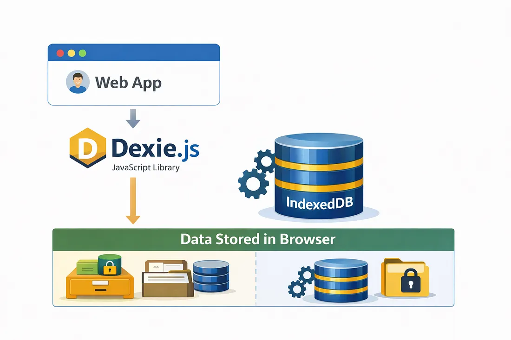
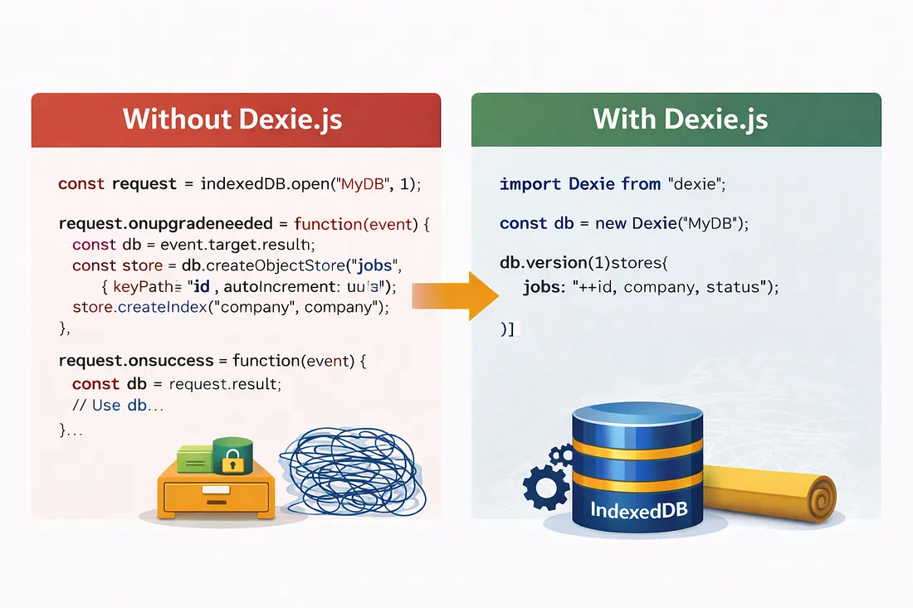
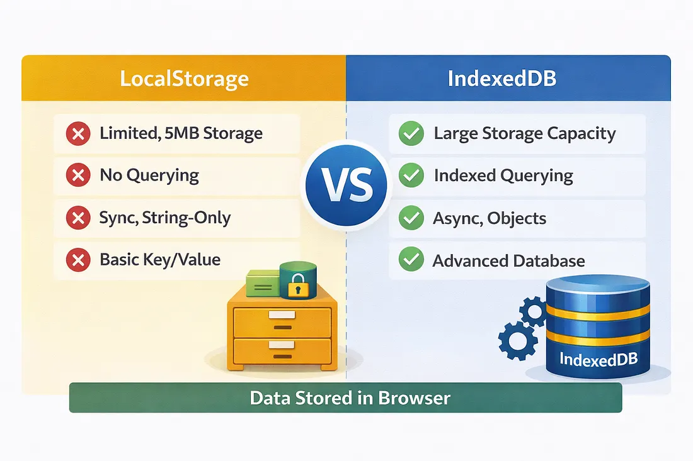
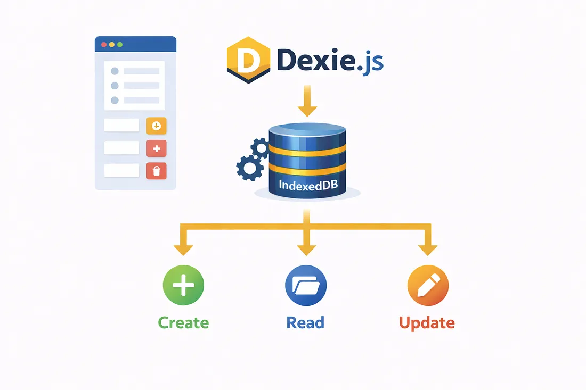
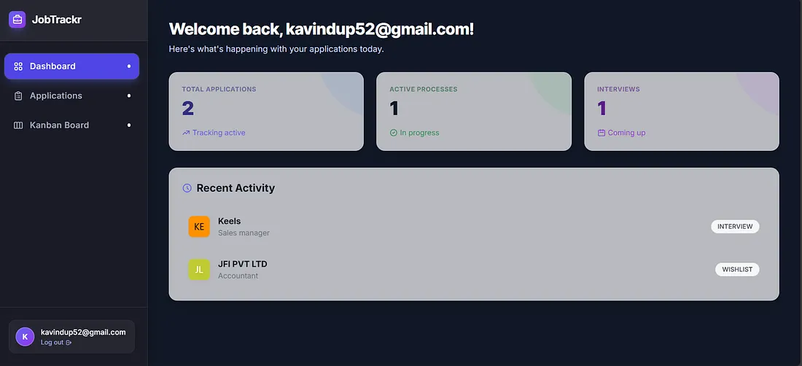
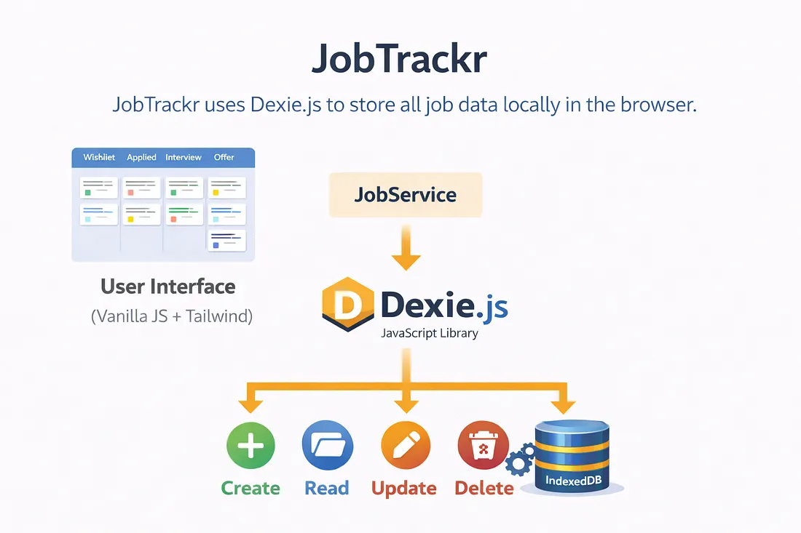
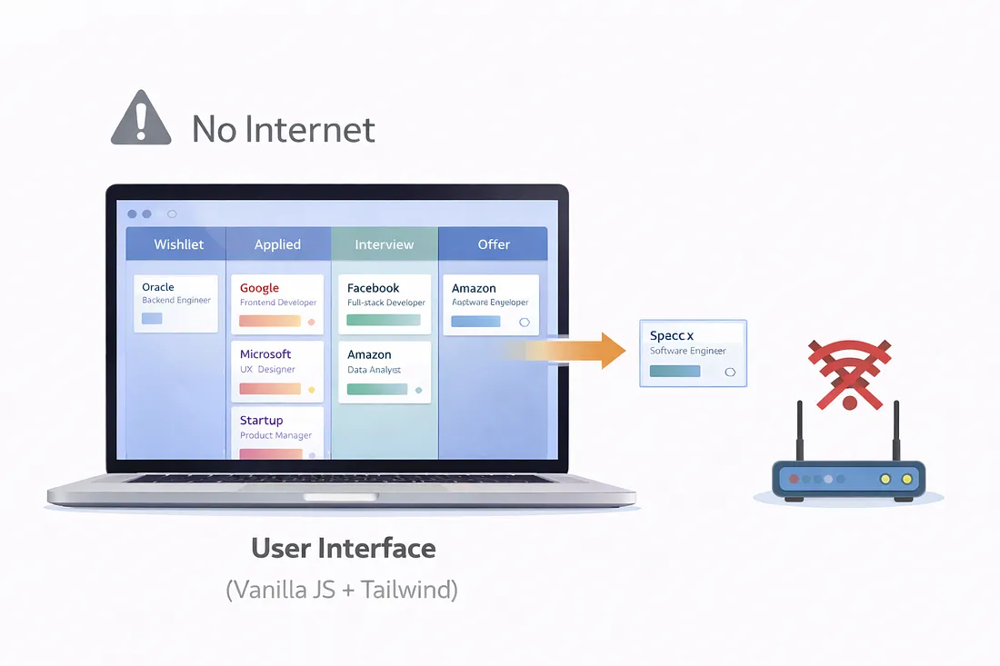

# 🚀 Dexie.js: Build Real Database-Powered Web Apps — No Backend Required

> 📖 Originally published on Medium  
> https://medium.com/@kavindup52



Most modern web apps lean on backend databases like PostgreSQL, MongoDB, or Firebase for data persistence.  
But what if your app could store, query, and manage structured data entirely in the browser, work offline, feel snappy, and still behave like a real database app?

Enter **Dexie.js** — the minimalist wrapper that turns the browser's built-in IndexedDB into something actually enjoyable to use.

In this article we’ll cover:
- What IndexedDB really is (and why most devs avoid it)
- How Dexie.js fixes its pain points
- Why it's a game-changer for offline-first apps
- A hands-on example: **JobTrackr** — an offline job application tracker

---

# 🌐 The Browser's Hidden Superpower: IndexedDB

Everyone knows **localStorage** and **sessionStorage**.  
They're simple — but terribly limited.

The browser actually ships with **IndexedDB**, a full-fledged NoSQL database that offers:

- Large storage (hundreds of MBs or more)
- Indexed queries for fast lookups
- Structured objects (no JSON stringifying)
- Asynchronous & transactional operations
- High performance with thousands of records

The catch? Raw IndexedDB is **not developer friendly**.  
It’s full of event handlers, version upgrades, cursors, and boilerplate.

That’s exactly what Dexie.js fixes.



---

# ⚡ Dexie.js: IndexedDB, But Developer-Friendly

Dexie.js is a thin **promise-based wrapper** around IndexedDB.

### Raw IndexedDB
```js
const request = indexedDB.open("MyDB", 1);
request.onupgradeneeded = (event) => {
  // painful schema stuff
};
````

### Dexie.js

```js
import Dexie from "dexie";

const db = new Dexie("MyDB");
db.version(1).stores({
  tasks: "++id, title, status, priority"
});

await db.open();
```

Simple schema. Automatic upgrades. No callback hell.

Dexie works with:

* React
* Vue
* Angular
* Svelte
* Vanilla JS

---

# 💡 LocalStorage vs Dexie.js / IndexedDB

| Feature       | LocalStorage     | Dexie + IndexedDB |
| ------------- | ---------------- | ----------------- |
| Storage limit | ~5–10MB          | Hundreds of MBs+  |
| Data type     | Strings only     | Rich JS objects   |
| Querying      | Manual filtering | Indexed queries   |
| Performance   | Poor at scale    | Optimized         |
| Transactions  | ❌                | ✅                 |
| Async         | ❌                | Promise-based     |
| Offline-first | Basic            | Excellent         |

LocalStorage is for preferences.
Dexie is for **real apps**.

---

# 🛠️ Quick Start with Dexie

Install:

```bash
npm install dexie
```

Create a database:

```js
import Dexie from "dexie";

export const db = new Dexie("JobTrackrDB");

db.version(1).stores({
  jobs: "++id, company, role, status, createdAt"
});
```

That’s your entire schema.

---

# ✨ CRUD in 30 Seconds

```js
// Create
await db.jobs.add({
  company: "xAI",
  role: "AI Engineer",
  status: "Applied",
  createdAt: new Date()
});

// Read
const allJobs = await db.jobs.toArray();

// Query
const interviews = await db.jobs
  .where("status")
  .equals("Interview")
  .sortBy("createdAt");

// Update
await db.jobs.update(jobId, { status: "Offer" });

// Delete
await db.jobs.delete(jobId);
```

No backend. No APIs. Instant local operations.



---

# 💼 Real-World Example: JobTrackr

🔗 Repo:
[https://github.com/kspeiris/JobTrackr_Mini-Project](https://github.com/kspeiris/JobTrackr_Mini-Project)

🔗 Live demo: https://jobtrackr-peiris.netlify.app


**JobTrackr** is a Kanban-style job application tracker that runs **100% in the browser**.

### Features

* Track jobs across stages
  Wishlist → Applied → Interview → Offer → Rejected
* Drag & drop status updates
* Notes, salary range, timestamps
* Dashboard statistics
* Fully offline
* Built with **Vite + Tailwind + Vanilla JS**



### Why Dexie was perfect

* Offline-first
* Fast queries
* Privacy-friendly
* Free static hosting

Schema powering the app:

```js
db.version(1).stores({
  jobs: "++id, company, role, status, createdAt"
});
```

---

# 📱 Why Offline-First Matters

Modern users expect apps to:

* Load instantly
* Work without internet
* Respect privacy
* Feel native-like

Dexie makes this possible **without a backend**.



---

# 🚫 When NOT to Use Dexie

Skip Dexie if you need:

* Multi-user real-time collaboration
* Server-side authentication
* Centralized analytics

Dexie shines for **single-user apps & PWAs**.

---

# 🧠 What Building JobTrackr Taught Me

* Frontend-only apps can be powerful
* Instant feedback loops feel amazing
* Client-side data modeling matters
* Sometimes the simplest stack wins

Dexie changed how I build side projects.

---

# 🎯 Final Thoughts

Dexie.js is one of the most underrated frontend tools.

Perfect for:

* Productivity tools
* Personal trackers
* PWAs
* Offline mini-apps


👉 Check out JobTrackr:
[https://github.com/kspeiris/JobTrackr_Mini-Project](https://github.com/kspeiris/JobTrackr_Mini-Project)

Happy coding & offline hacking 🚀
