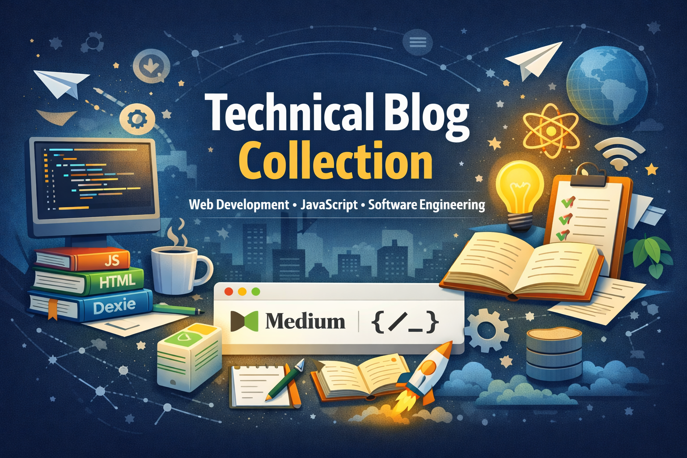

---

# ✍️ Technical Blog Collection

Welcome to my **Engineering Writing Hub** 📚
This repository contains all of my technical articles originally published on Medium, rewritten in Markdown and organized for easy reading on GitHub.

I write about **Web Development, JavaScript, Software Engineering, and my project experiences.**

🌐 **Read on Medium:** https://medium.com/@kavindup52

---

## 👨‍💻 About Me

Hi, I'm **Kavindu Peiris** — a Software Engineering undergraduate passionate about building real-world applications and sharing what I learn along the way.

I use writing as a way to:

* Strengthen my understanding of technologies
* Document my projects
* Help other developers learn faster
* Build in public 🚀

Each article includes:

* Clean Markdown formatting
* Code snippets
* Diagrams & screenshots
* Link to original Medium article

---

## 📝 Why This Repository Exists

Technical writing is an essential skill for engineers.
This repository serves as my **knowledge base** and **learning journal** where I document concepts, tools, and project experiences.

1. [Modern ERP Systems in 2026: A Functional Overview](A_Functional_Overview_of_Modern_ERP_Systems.md)
2. [Dexie.js: Build Real Database-Powered Web Apps — No Backend Required](Dexie.js_Build_Real_Database.md)
3. [Modern Bot Detection Series — Part 1-The Rise of Smart Bots— Why CAPTCHA Is No Longer Enough](The_Rise_of_Smart_Bots.md)
4. [The Death of jQuery? Not Really.](The_Death_of_jQuery_Not_Really.md)
5. [JavaScript vs TypeScript](JavaScript_vs_TypeScript.md)
6. [Modern Bot Detection Series — Part 2-Understanding Coordinated Bot Attacks in Modern Applications](Understanding_Coordinated_Bot_Attacks_in_Modern_Applications.md)
7. [Why Developers Should Learn Business Skills](Why_Developers_Should_Learn_Business_Skills.md)
8. [The Rise of AI-Assisted Development](The_Rise_of_AI-Assisted_Development.md)

---

## 🚀 Topics I Write About

* JavaScript & Web APIs
* Offline-First Applications
* IndexedDB & Dexie.js
* Software Engineering Concepts
* Personal Projects & Case Studies

---

## 🤝 Connect With Me

* 💼 LinkedIn: https://www.linkedin.com/in/kavindu-peiris-149375297
* ✍️ Medium: https://medium.com/@kavindup52
* 💻 GitHub: [https://github.com/kspeiris](https://github.com/kspeiris)

---

⭐ If you find these articles helpful, consider giving this repository a star!
