# The Rise of AI-Assisted Development in 2026
### How AI is changing the way developers build software

---

## Introduction

Software development in 2026 looks dramatically different from just a few years ago. AI-assisted tools are no longer experimental sidekicks; they have become part of the daily workflow for developers across startups, enterprises, and open-source communities.

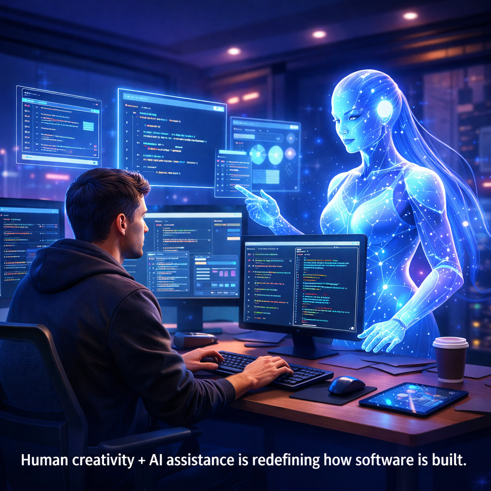

From writing boilerplate code to debugging complex systems, AI tools are reshaping how developers think, build, and collaborate. But the reality is more nuanced than the hype. Tools like GitHub Copilot, Cursor, and Claude Code are not just autocomplete on steroids; they are enabling entirely new ways of working that blend human creativity with machine efficiency.

Are developers actually more productive? What new skills matter now? And what happens to junior vs senior roles? In this expanded article, we dive deeper into each aspect, drawing from real-world examples, industry reports, and emerging trends to give you a comprehensive view.

Let us explore what is really happening.

---

## How Developers Actually Use AI in Real Workflows

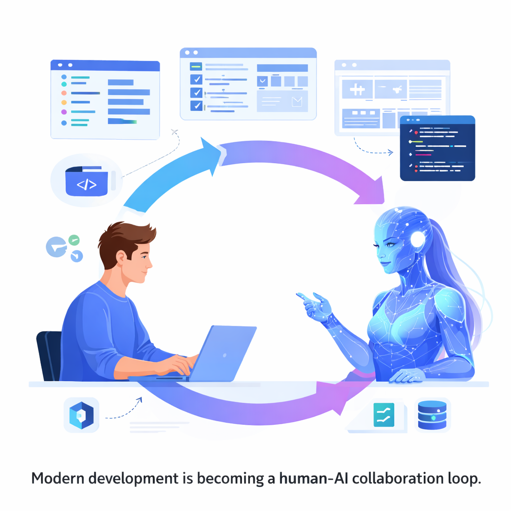

One of the biggest misconceptions is that developers simply "ask AI to build apps." In reality, the workflow has evolved into human-AI collaboration, where AI acts as a tireless assistant, but humans remain the architects.

To illustrate, consider a typical day for a full-stack developer at a mid-sized tech firm. They might start with a feature request, like building a user authentication system. Instead of diving straight into code, they engage AI early and often.

### The "15-Minute Waterfall" Planning Phase

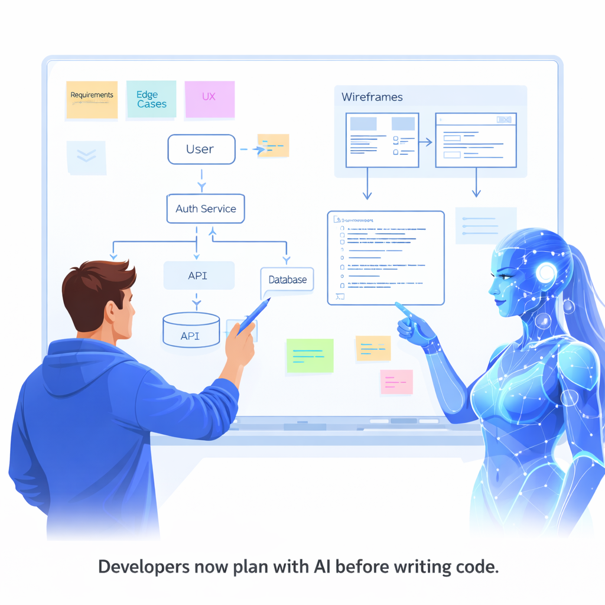

Before writing code, developers now spend time collaborating with AI to:

- Brainstorm requirements: For example, using AI to list out must-have features like password hashing, two-factor authentication, and session management.
- Explore edge cases: AI can simulate scenarios, such as "What if a user enters an invalid email?" or "How do we handle brute-force attacks?"
- Define UX decisions: Tools like Figma integrated with AI might suggest wireframes, but in code workflows, AI helps outline user flows.
- Draft technical specifications: This could generate a Markdown doc with pseudocode, APIs, and database schemas.

This short planning phase, often just 15 minutes, dramatically reduces downstream bugs and rework. According to a 2025 Stack Overflow survey, teams using this approach report 30% fewer revisions in pull requests. AI becomes part of the thinking process, not just the coding phase, turning vague ideas into structured plans.

---

### AI Handles the Repetitive Work

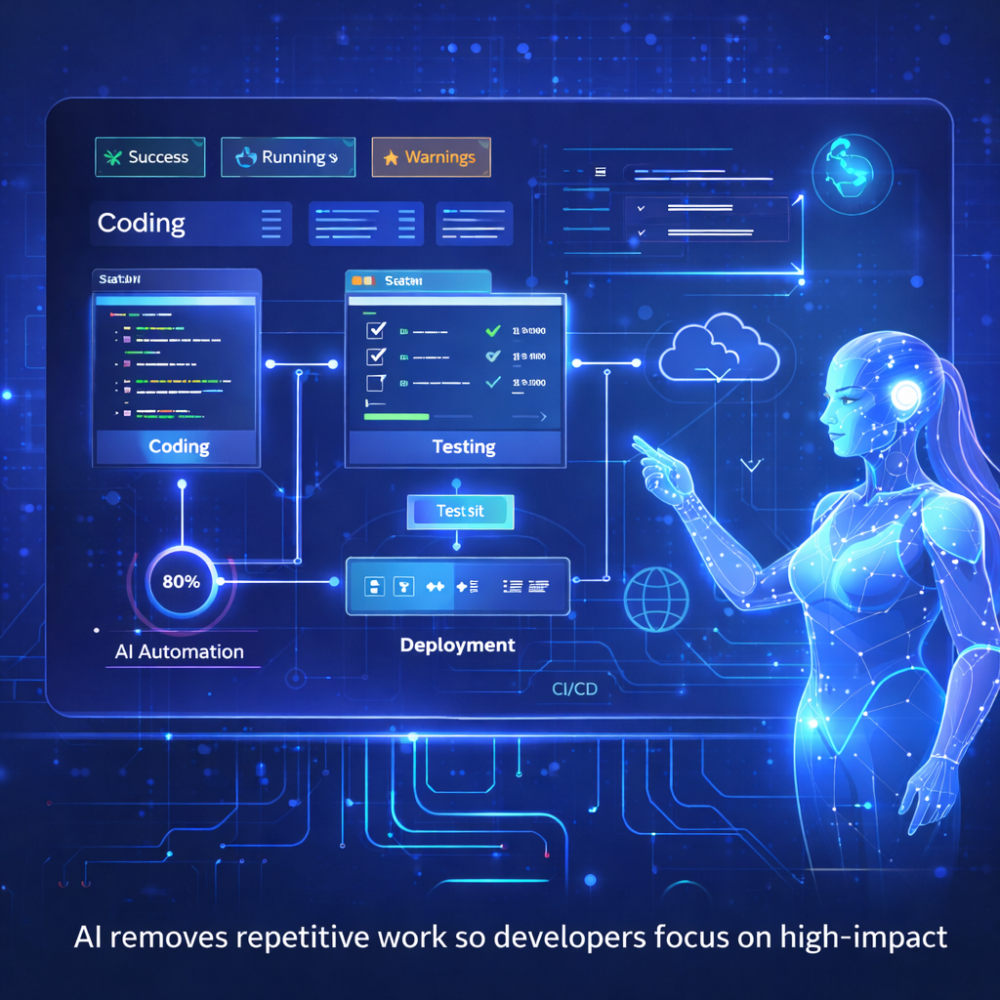

Developers now use AI tools to automate:

- Boilerplate generation: Instant scaffolds for React components, Express routes, or Django models.
- Unit tests and integration tests: AI can write Jest or pytest suites based on function descriptions, covering 80% of basic cases.
- Debugging and refactoring: Tools like GitHub Copilot's "explain this code" feature or Cursor's auto-fix can spot memory leaks or optimize loops.
- Documentation generation: Auto-creating READMEs, API docs with Swagger, or inline comments.
- Deployment checks: Integrating with CI/CD pipelines to suggest Dockerfiles or Kubernetes configs.

Instead of replacing developers, AI removes the low-leverage tasks that used to consume hours. For instance, a developer at Google reported in a 2026 blog post that AI cut their time on setup code from 4 hours to 20 minutes per project.

This frees developers to focus on:

- Architecture decisions: Choosing microservices vs. monoliths.
- Complex problem solving: Integrating with legacy systems or optimizing for scale.
- Product thinking: Aligning code with business metrics like user retention.
- User experience: Ensuring accessibility and performance.

---

### Context Is Everything

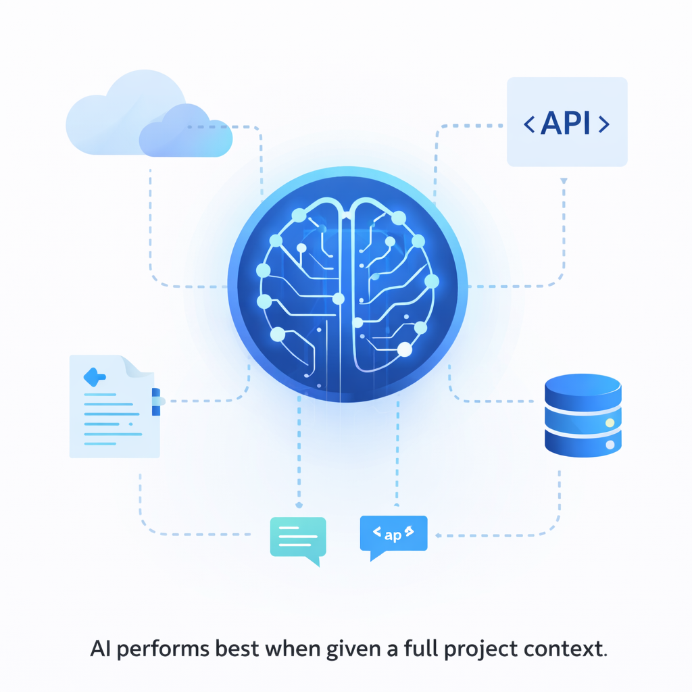

AI performs best when given detailed context:

- Existing codebase: Uploading snippets or linking repos for AI to reference.
- Business requirements: Specifying "This must comply with GDPR" or "Optimize for mobile-first."
- System architecture: Describing stacks like MERN or LAMP.
- Constraints and edge cases: Such as "Handle 10,000 concurrent users" or "Support offline mode."

Experienced developers treat AI like a junior teammate: they provide instructions, review outputs, and iterate. A common pitfall for beginners is vague prompts leading to hallucinated code, such as AI suggesting deprecated libraries without context.

The modern workflow looks like this:

1. AI proposes solutions, such as a full function draft.
2. Developers review and refine the output, for example by adding error handling.
3. AI improves the next iteration based on feedback, such as "Make it asynchronous."

This loop is now known as **AI-assisted engineering**. In agentic setups, such as Devin or SWE-agent, AI can even handle full cycles autonomously under supervision, but most workflows remain hybrid for reliability.

---

## Real Productivity Gains vs. the Hype

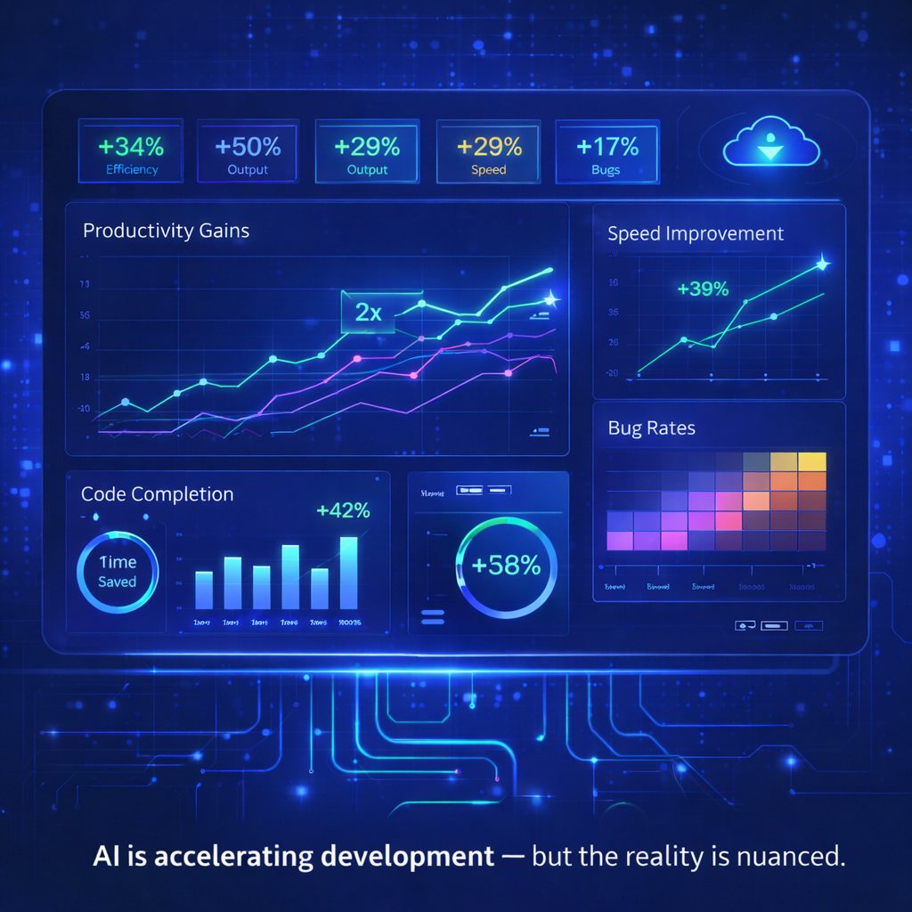

AI promises massive productivity gains, with headlines touting "10x developers." But the real data from 2026 tells a more balanced story, backed by studies from McKinsey, Gartner, and independent benchmarks.

### Where AI Delivers Real Speed

AI performs extremely well in repetitive and structured tasks, leading to measurable wins.

Typical gains seen across teams:

- Faster coding cycles for routine tasks: A 2026 GitHub report shows developers completing features 25-50% faster.
- Faster documentation and testing: AI-generated tests can cover branches that humans overlook, reducing QA time by 40%.
- Faster onboarding for new technologies: Learning Rust or WebAssembly? AI explains concepts and provides examples in minutes.

Many developers report saving 10+ hours per week by offloading repetitive work. For example, in call centers using AI for scripting, productivity jumped 14%, according to a McKinsey study. In software, Goldman Sachs noted AI drafting legal docs in minutes instead of weeks, projecting similar gains for their 12,000 developers.

---

### Where the Hype Breaks Down

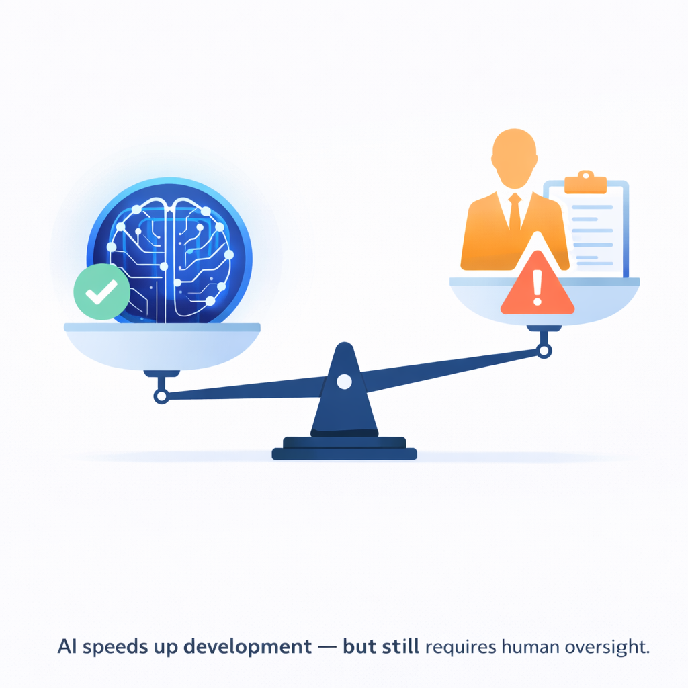

However, AI has introduced new bottlenecks:

- Pull request review times have increased: With more code generated, reviews take longer in some teams because of subtle errors.
- Bug rates can slightly increase without proper oversight: AI might introduce vulnerabilities, like insecure SQL queries.
- Integration into enterprise workflows is difficult: Legacy systems and compliance requirements, such as HIPAA, slow adoption.
- Many AI pilots fail to scale across organizations: Enterprise experiments often stall before reaching production-wide use.

AI often gets projects 60% done quickly, but the final 40% still requires human expertise for nuance, such as handling ambiguous requirements. The takeaway is clear: AI is a strong accelerator, not a full replacement.

---

## New Skills Developers Must Learn

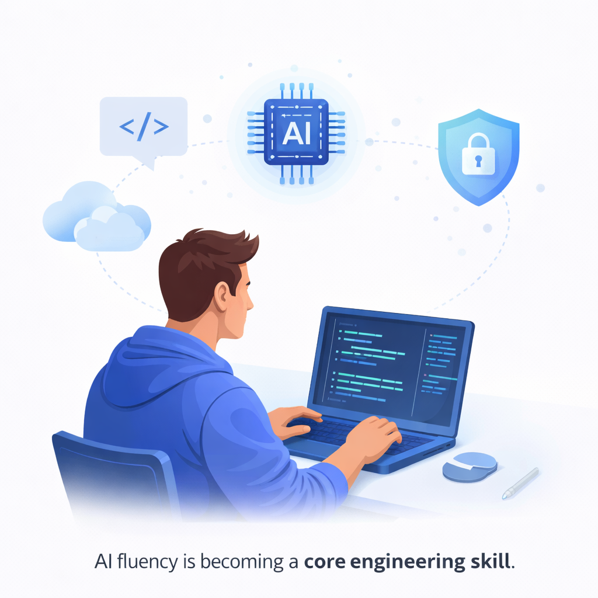

As AI takes over routine coding, the required skill set is evolving fast. By 2026, many job postings emphasize AI fluency alongside traditional tech stacks.

### 1. Prompt Engineering

Developers must learn how to:

- Write clear instructions: For example, "Generate a REST API in Node.js for user login, using JWT and bcrypt, with error handling for invalid credentials."
- Provide context: Include code samples, constraints, and expected behavior.
- Guide AI toward correct outputs: Iterate with concrete corrections and better prompts.

Good prompts are becoming a core engineering skill. Poor prompts waste time; strong prompts improve output quality dramatically.

---

### 2. AI Literacy

Developers need to understand:

- Strengths and limitations of AI tools: Strong on patterns, weaker on novel problems.
- Ethical and security considerations: Bias in training data or leaking sensitive code.
- How to integrate AI responsibly: Through APIs, IDE plugins, or custom agents.

AI is now part of the engineering toolkit, much like Git or Docker.

---

### 3. Critical Thinking and Oversight

AI can generate code. But it cannot:

- Understand business goals: Aligning features with revenue targets.
- Evaluate trade-offs: Speed vs. scalability.
- Guarantee correctness: Hallucinations require human verification.

Developers must verify and refine AI output. This includes running tests, code reviews, and simulations. Thinking matters more than typing; skills like decomposition and hypothesis testing are key.

---

### 4. Full-Stack Foundations Still Matter

Ironically, AI makes fundamentals more important, not less.

To guide AI effectively, developers must understand:

- Architecture: Designing scalable systems.
- Databases: SQL vs. NoSQL choices.
- APIs: REST and GraphQL integration.
- Security: OWASP principles.
- Cloud infrastructure: AWS and Azure deployment.

You cannot review what you do not understand. Plus, emerging practices like "vibe coding," where people describe apps in English for AI to build, still require deep technical knowledge to iterate safely.

---

### Skill Shift Summary

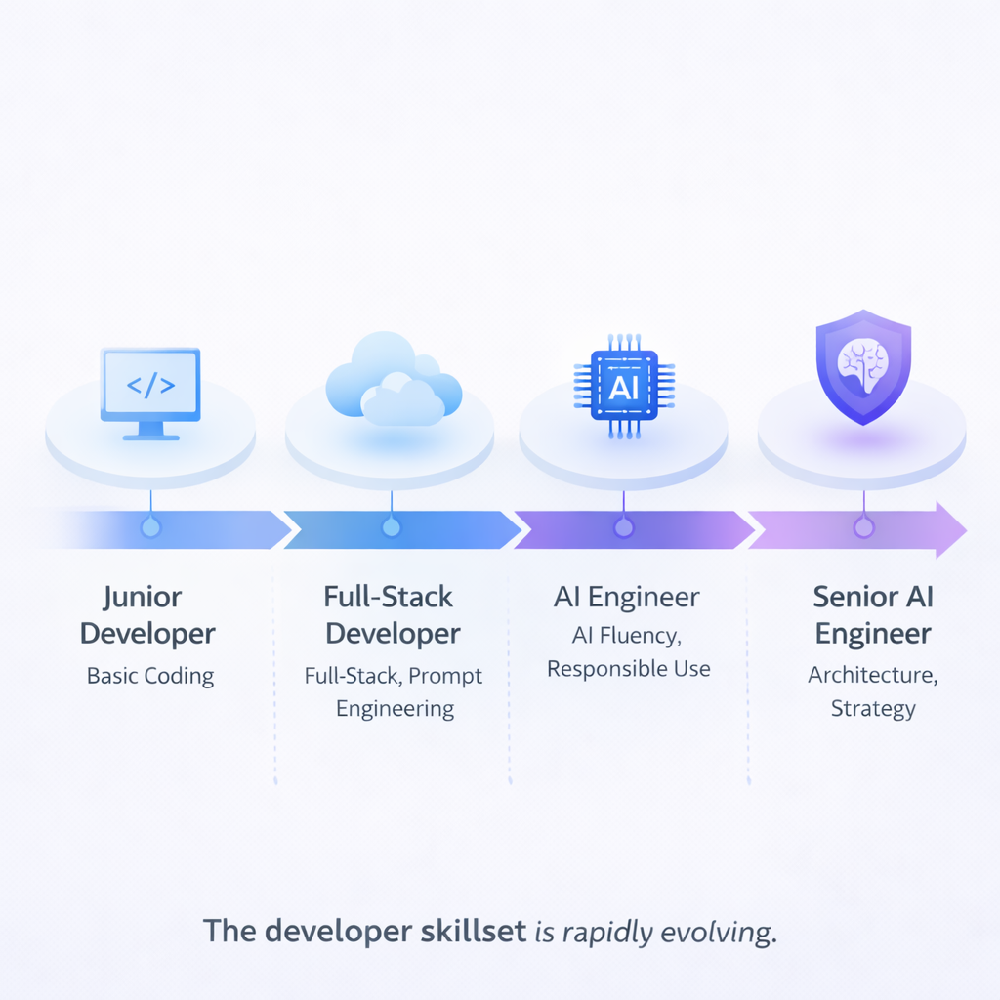

| Skill Area | Key Examples | Why It Matters | Real-World Tip |
|------------|--------------|----------------|----------------|
| AI-Specific | Prompt engineering, AI literacy | Direct AI effectively | Practice with tools like ChatGPT for code |
| Technical | Full-stack, cloud, security | Build real systems | Certify in AWS or similar |
| Human Skills | Critical thinking, collaboration | Provide judgment and strategy | Join hackathons for oversight practice |

---

## The Future of Junior vs. Senior Roles

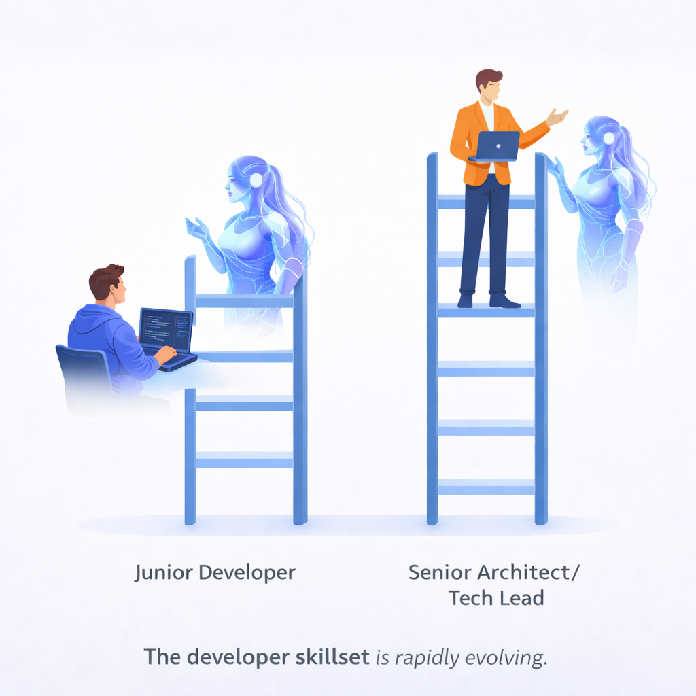

AI is reshaping the developer career ladder, compressing entry points while amplifying expertise.

### Junior Roles Are Being Compressed

Entry-level tasks are the easiest to automate:

- Boilerplate coding: AI handles CRUD operations.
- Simple debugging: Auto-fixing syntax errors.
- Basic refactoring: Suggesting cleaner code.

This has reduced demand for traditional junior roles in some companies. Instead, many teams now expect juniors to:

- Use AI tools effectively from day one.
- Learn faster through AI-assisted tutorials.
- Contribute to real features sooner while overseeing AI output.

The new entry-level role is evolving into the **AI-enabled developer**, blending coding with prompt mastery. However, this also risks creating a "lost generation" if juniors do not get enough hands-on experience.

---

### Senior Developers Are Becoming More Valuable

AI increases the importance of:

- System architecture: Holistic design.
- Integration decisions: Merging AI with existing systems.
- Technical leadership: Mentoring humans and guiding AI use.
- Risk management: Ensuring AI does not introduce flaws.

As AI handles more implementation, seniors focus more on strategy and direction. That raises the value of experience, judgment, and architectural thinking.

---

## The Big Picture

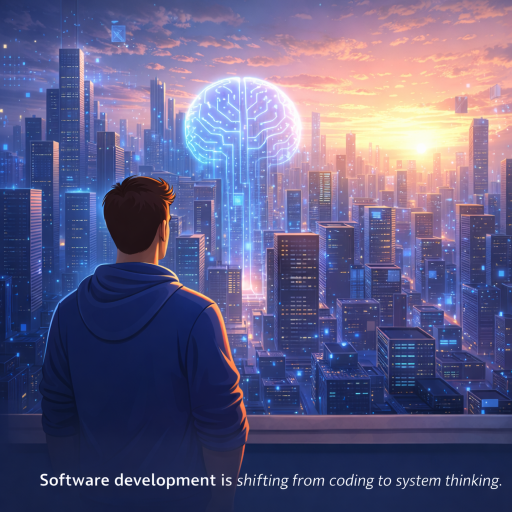

AI-assisted development is not about replacing developers.

It is about changing the nature of the job.

Developers are moving:

- From typing code to designing systems
- From writing syntax to solving problems
- From implementation to decision making

This shift empowers solo developers to build startups faster and enables teams to innovate more boldly.

---

## Conclusion

AI-assisted development in 2026 represents a major shift in how software is built.

- Workflows are more collaborative
- Productivity gains are real but nuanced
- New skills focus on thinking and oversight
- Career paths are evolving rapidly

The developers who thrive will not be the ones who resist AI; they will be the ones who learn to work with it.

**The future belongs to AI-augmented developers.**
