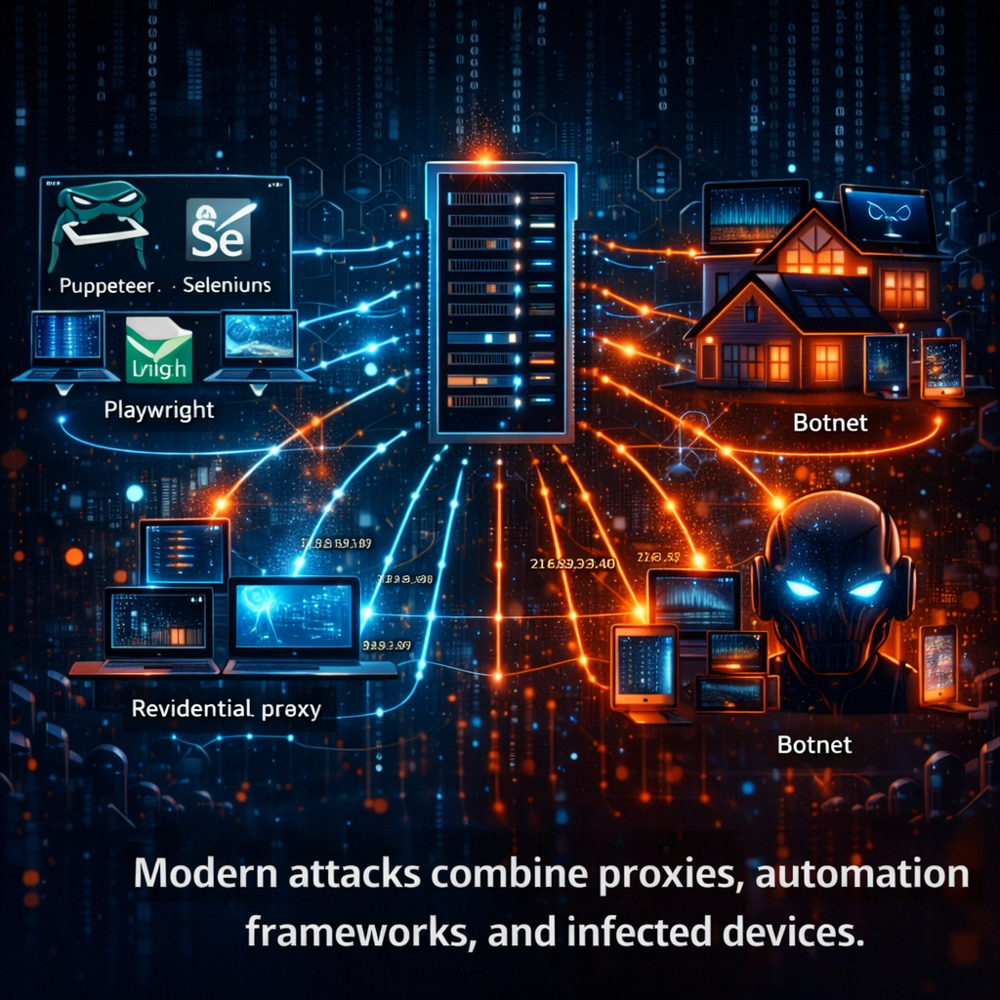
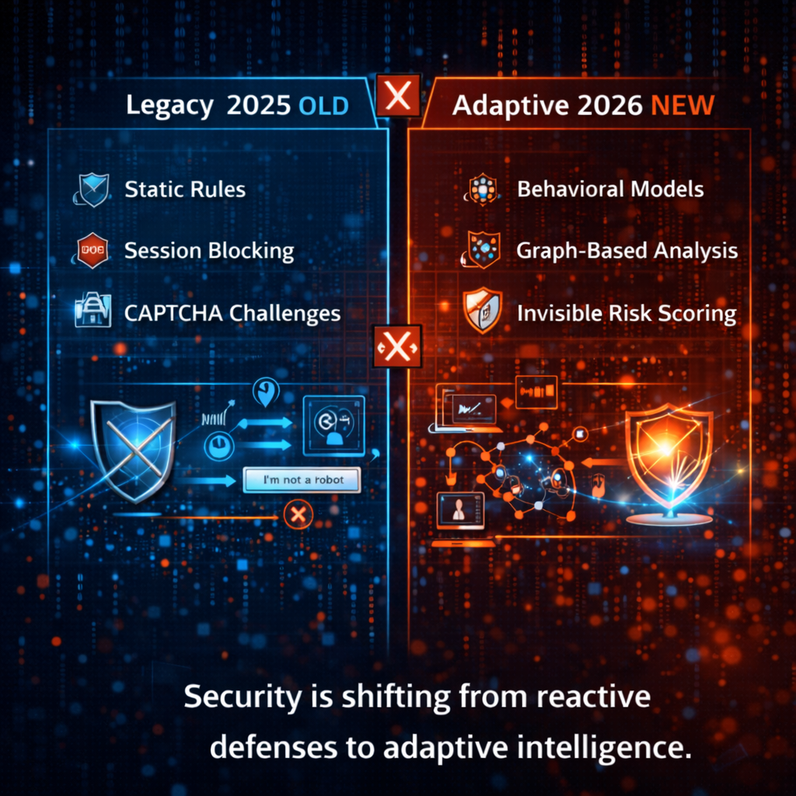

# Understanding Coordinated Bot Attacks in Modern Applications
🕸 Modern Bot Detection Series - Part 2

📖 Originally published on Medium  
> https://medium.com/@kavindup52/modern-bot-detection-series-part-2-01fa84ae551f

In **Part 1**, we explored how bots have evolved beyond basic scripts and why simple CAPTCHA checks are no longer sufficient.

Now, let's dive deeper.

The major threat in 2026 isn't solitary bots it's **coordinated bot attacks**. These are larger, smarter, and far harder to detect than ever before.

## 🤖 What Is a Coordinated Bot Attack?

A coordinated bot attack occurs when multiple automated programs collaborate toward a single objective.

Instead of one bot hammering a site from a single source, a swarm divides the workload across thousands of sessions, devices, and locations making detection extremely difficult.

According to the **2025 Imperva Bad Bot Report**, bad bots now account for **37%** of all web traffic. For the first time, automated traffic has surpassed human traffic, reaching **51%** of global internet activity.

Common examples in 2025–2026 include:

- Creating massive numbers of fake accounts to exploit promotions, deals, and rewards
- Distributed data scraping (often for AI training datasets)
- Large-scale credential stuffing campaigns using stolen login details
- Manipulating reviews, inflating fake likes, or running social media influence operations
- Scalping tickets, limited-edition items, or stock to resell at inflated prices

Individually, each bot mimics real human behavior.  
But collectively, clear numerical and behavioral patterns emerge—patterns that single-session detection tools miss.

## 🌐 How Coordinated Bots Operate in 2026

Today's bot swarms are powered by advanced infrastructure and techniques:

- Sophisticated headless browsers (**Puppeteer**, **Playwright**, **Selenium**) that emulate realistic human interactions
- Rotating residential proxies from massive pools (often exceeding 200 million IPs)
- Huge botnets of compromised devices, such as the **Aisuru botnet** (estimated 1–4 million infected machines), which drove massive DDoS floods in late 2025
- AI-driven scripts that randomize mouse movements, typing cadence, and navigation paths
- Real-time orchestration across multiple tools and targets

Real-world example: In October 2025, **GreyNoise** identified a botnet with over **100,000 IPs** (later growing to ~300,000) launching synchronized attacks on US systems, using matching technical fingerprints and coordinated timing across 100+ countries.

These attacks avoid obvious floods. Instead, they:

- Distribute activity over days and multiple time zones
- Insert realistic human-like delays and pauses
- Rotate user agents, device fingerprints, canvas data, and more
- Behave like ordinary users on mobile or desktop devices

The outcome? Bot traffic that can appear **more human-like** than actual human traffic when analyzed in aggregate.

## 🔍 Why Traditional Detection Fails — 2026 Edition

Legacy defenses are crumbling:

- **IP blacklisting** → Ineffective against rotating residential proxies
- **Rate limiting** → Easily bypassed by low-volume actions per bot
- **Static device fingerprinting** → Defeated by spoofing and AI randomization
- **CAPTCHA challenges** → Frequently solved or bypassed (success rates >70% for advanced bots)

During the 2025 holiday season, massive bot activity hit e-commerce and ticketing platforms hard **DataDome** reported surges like millions of malicious requests targeting checkout and inventory flows, all distributed to evade thresholds.

The core problem: Traditional tools analyze **one session at a time**. Coordinated attacks thrive on **scale and distribution**.

## 📊 The Power of Collective Patterns (The 2026 Reality)

The key insight transforming bot defense:

**One session may look legitimate. The group reveals the truth.**

Coordinated bots frequently exhibit:

- Synchronized timing gaps (e.g., sign-ups every ~47 seconds)
- Highly similar interaction patterns (e.g., matching mouse velocity curves across "different" sessions)
- Identical navigation paths (e.g., exact sequence of clicks)
- Event-driven spikes (Black Friday, ticket drops, major votes)

Real example from 2025: During high-demand ticket sales (including Coldplay events), scalper bots used residential proxies and varied behaviors but aggregate analysis later revealed tight correlations in movement, typing, and timing, enabling thousands of seats to be grabbed rapidly.

Another case: E-commerce platforms detected **hundreds of thousands** of fake accounts created in coordinated waves to harvest referral bonuses.

We must shift from per-session checks to **large-scale pattern and correlation analysis**.

## 🧠 Behavioral Correlation as a Defense Strategy

Leading platforms in 2026 succeed by analyzing group-level behaviors:

- Cross-session matching of interaction styles (mouse wobble, keystroke timing, scroll patterns)
- Graph-based clustering to identify tight "bot clusters"
- Timing correlation scoring (e.g., 500 sign-ups within 0.3-second windows)
- Advanced models like isolation forests, graph neural networks, and anomaly detection at scale

Recent studies show behavioral approaches achieve **85–92%** accuracy against sophisticated bots significantly outperforming traditional methods like reCAPTCHA (~69%).

Even AI-powered bots struggle at massive scale: When thousands run from similar codebases, their behaviors converge too closely creating detectable statistical fingerprints.

## ⚡ Real-Time Detection Challenges in 2026

Implementing this live is hard:

- Processing massive streams of behavioral data
- Delivering risk scores in **<50 ms**
- Consistent protection across web, mobile, and APIs
- Avoiding false positives that frustrate real users
- Complying with privacy regulations (GDPR, CCPA, etc.)

Modern systems run lightweight edge detection, use federated learning for updates, and avoid storing sensitive user data.

## 🛡 Why This Matters for Every Developer in 2026

Think bots only target big companies? Think again.

Victims in 2025–2026 included:

- E-commerce stores (promo abuse, inventory hoarding)
- SaaS platforms (fake sign-ups, credential stuffing)
- Early-stage apps (artificial likes, inflated users)
- Educational and government sites

With cheap residential proxies and AI orchestration, mid-sized applications are prime targets.

## 🔮 The Direction of Modern Defense

We're moving from:

- Static rules → Adaptive, always-on behavioral analysis
- Single-session blocking → Graph-based group detection
- Legacy CAPTCHAs → Invisible, continuous risk scoring

Fighting coordinated bots is now about uncovering **hidden numerical signals** in seemingly normal traffic.

## 🏁 Final Thoughts

Bots have evolved from lone scripts into massive, coordinated ecosystems powered by residential proxies, AI mimicry, and real-time orchestration.

The threat is no longer obvious it's **distributed**, **statistical**, and **group-based**.

In **Part 3**, we'll explore **behavioral fingerprinting** the most powerful signal yet for detecting coordinated automation in 2026.

## 🔗 Series Overview  
**Modern Bot Detection in Web & Mobile Applications**

- **Part 1** — The Rise of Smart Bots
- **Part 2** — Understanding Coordinated Bot Attacks
- **Part 3** — Behavioral Fingerprinting Explained
- **Part 4** — Machine Learning for Bot Detection
- **Part 5** — Cross-Platform Detection Challenges

Stay tuned.