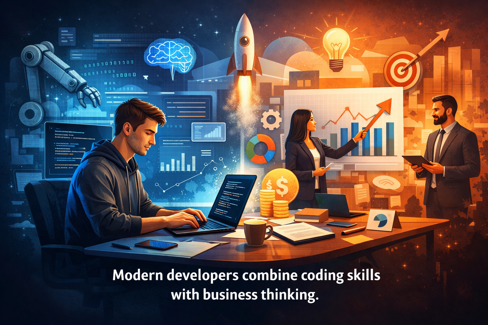
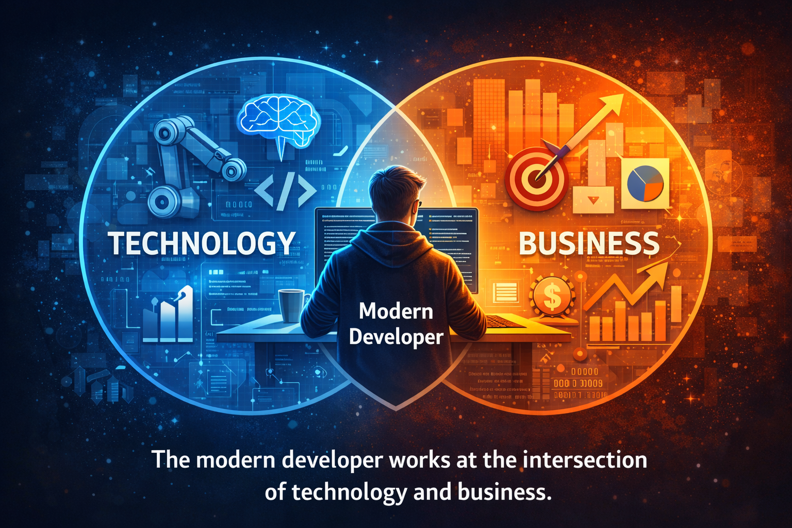
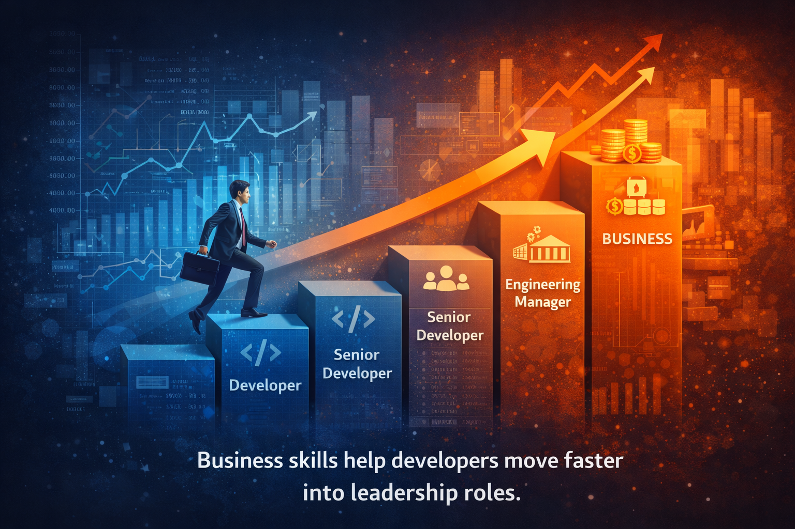
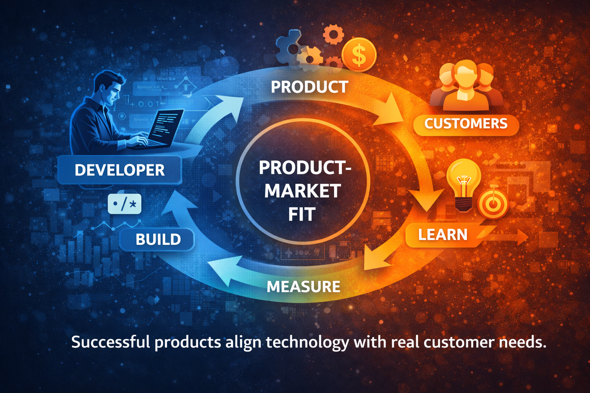
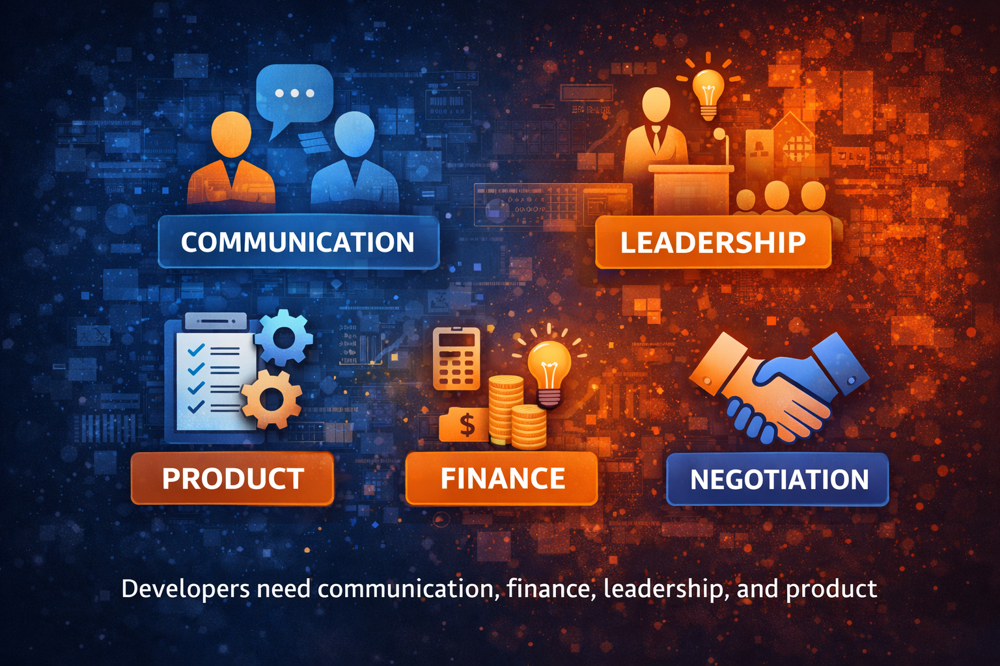
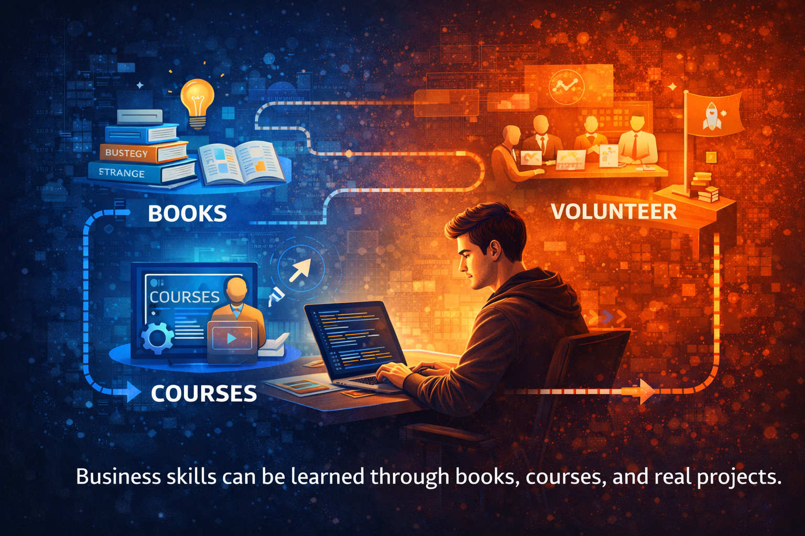
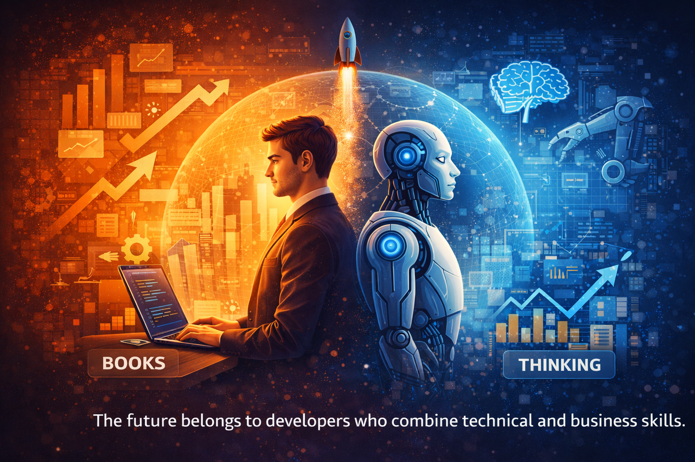

# Why Developers Should Learn Business Skills

> 📖 Originally published on Medium  
> https://medium.com/@kavindup52/why-developers-should-learn-business-skills-in-2026-1528a739064d

In today's tech industry, writing clean code is no longer enough. The developers who advance fastest, earn more, and build meaningful products are not just technical experts; they understand business.

If you have ever wondered why some developers become engineering leaders, founders, or high-impact decision makers while others stay stuck in purely technical roles, the difference is often business knowledge.

The tech world in 2026 is changing rapidly. AI is automating repetitive coding tasks, remote work has globalized hiring, and companies are more focused than ever on measurable business outcomes. Developers who understand strategy, finance, communication, and product thinking are becoming indispensable.

Let us explore why business skills are now a must-have for developers and how you can start learning them today.

---

## The Developer Role Is Evolving

Years ago, developers were often seen as specialists who worked mainly on implementation. Today, the most impactful engineers operate at the intersection of technology and business.

Every feature you build ultimately supports a business goal:

- Increasing revenue
- Improving efficiency
- Reducing costs
- Retaining customers
- Expanding market reach

Without understanding the business context, even technically perfect solutions can fail.

Great developers do not just ask **"How do we build this?"** They ask **"Why are we building this?"**

That shift changes everything.

Developers who understand product goals and business strategy can:

- Make smarter technical decisions
- Avoid building unnecessary features
- Deliver higher real-world impact

This is how developers become strategic thinkers instead of task executors. As AI reshapes teams into smaller, more efficient units, the demand for developers who can think like business leaders is rising sharply.

---

## Business Skills Accelerate Career Growth

The higher you go, the more business knowledge matters.

Leadership roles require:

- Communicating with executives
- Translating technical work into business value
- Prioritizing projects based on ROI
- Managing budgets and teams

This is why developers who understand business often move into:

- Engineering management
- Product leadership
- Startup founding
- Technical consulting

Business literacy turns you from a **cost center** into a **value creator**.

---

## Build Products That Actually Succeed

Have you ever built a feature that nobody used?

It happens everywhere.

Technical success does not guarantee product success.

Business awareness helps developers understand:

- Customer pain points
- Market demand
- Monetization strategies
- User behavior and retention

When developers understand business goals, they start prioritizing differently.

Instead of asking:

**"What can we build?"**

They ask:

**"What should we build to create value?"**

This mindset produces products that succeed in the real world.

---

## Entrepreneurship Becomes Possible

Many successful founders started as developers.

Why? Because developers already know how to build products.

What they often lack initially is knowledge about:

- Markets
- Pricing
- Growth
- Sales
- Finance

When developers learn business fundamentals, side projects can transform into real companies.

Today's tools make this easier than ever:

- Cloud platforms
- No-code tools
- Online payment systems
- Global marketplaces

A developer with business skills can launch globally from anywhere. The barrier to entrepreneurship has never been lower.

---

## High-Impact Business Skills for Developers

You do not need an MBA. Focus on high-leverage skills.

### 1. Stakeholder Communication

Learn to translate technical work into business impact.

Instead of:

> "We improved performance by 40%."

Say:

> "We reduced load times, which can increase conversions and improve revenue."

This skill makes your work visible and valued.

---

### 2. Financial Literacy

Understand basic business metrics:

- Revenue
- Costs
- ROI
- Burn rate
- Customer acquisition cost (CAC)
- Lifetime value (LTV)

This helps you prioritize work that matters.

---

### 3. Project and Product Thinking

Go beyond tasks and think in outcomes:

- Why is this feature important?
- Who benefits?
- How will success be measured?

This mindset is what separates senior engineers from juniors, and it is increasingly vital in AI-augmented teams.

---

### 4. Marketing and Customer Awareness

Developers who understand users build better products.

Learn:

- Why customers buy
- What drives retention
- How products grow

This makes your solutions more impactful.

---

### 5. Negotiation and Leadership

Business skills help you:

- Advocate for better salaries
- Influence decisions
- Lead teams effectively

These are career-defining abilities.

---

## How Developers Can Start Learning Business

You can start without quitting your job or enrolling in a degree.

### Read Foundational Books

Start with:

- *The Lean Startup* for validating ideas quickly
- *Good to Great* for building long-lasting companies
- *The Mom Test* for talking to customers without bias

---

### Take Online Courses

Look for beginner business courses on:

- Strategy
- Product management
- Finance basics

Many offer free audit options on platforms like Coursera or LinkedIn Learning.

---

### Learn at Work

Practical steps:

- Join cross-team projects
- Sit in product meetings
- Ask how success is measured
- Learn how your company makes money

Real-world exposure is powerful and often the fastest path to mastery.

---

### Build Side Projects Like a Business

Instead of just coding:

- Track users
- Measure growth
- Experiment with pricing
- Talk to customers

This is one of the fastest ways to learn.

---

## The Future Belongs to Hybrid Developers

The most valuable professionals in tech today combine:

**Technical skills + Business thinking**

These hybrid developers:

- Influence product direction
- Move into leadership roles faster
- Build successful startups
- Earn higher compensation
- Create meaningful impact

Business skills are no longer optional; they are a competitive advantage. In an era where AI handles more of the grunt work, the people who connect code to commerce will lead.

---

## Final Thoughts

Do not stop at writing code.

Learn how businesses work. Learn how value is created. Learn how decisions are made.

Start small. Pick one skill. Read one book. Take one course.

A year from now, you will be grateful you did.
